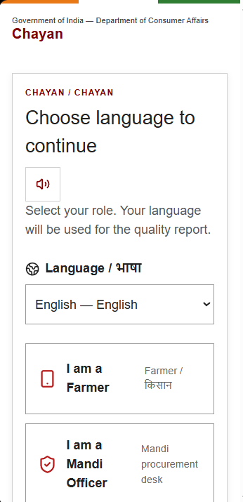
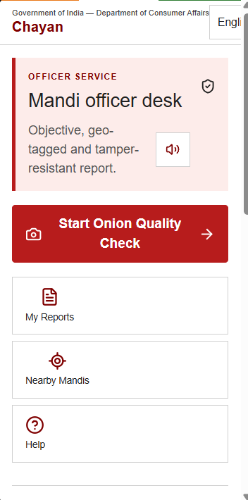
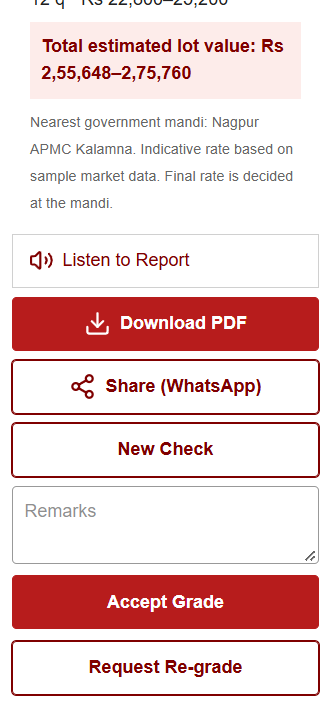

# Chayan

**SIH 2026 · Software Track · PS 26031 · Team PIPPO**

Chayan is a mobile-first prototype for more consistent onion quality assessment at mandis and procurement centres. It demonstrates a farmer/officer workflow for capturing a sample, recording location, and producing a standardized digital report. The intended outcome is fewer disputes caused by subjective grading.

## Prototype Highlights

1. Camera preview and browser geolocation for the sample workflow; officer capture is location-gated.
2. A simulated quality score, grade, defect breakdown, and indicative price per quintal.
3. A sample annotated-image illustration and a client-generated PDF report with a QR code.
4. A Nagpur-area OpenStreetMap view with sample procurement-centre pins.
5. English, Hindi, Marathi, and additional language choices, plus browser text-to-speech.
6. Demo flows for farmer/officer roles, report history, and re-grading requests.

These are prototype interactions, not a deployed procurement service. In particular, capture currently advances a demo flow rather than saving and analyzing camera frames; the report illustration, history, rates, and centre details are sample content. The QR value is static and does not verify a server-side record. Image-quality gates, persistent disputes/history, and live market-rate integration are not implemented.

## What Is Real, What Is Simulated

**Implemented in the web prototype:** Next.js UI; browser camera access (`getUserMedia`); browser geolocation; an interactive Leaflet/OpenStreetMap map; client-side PDF and QR generation; and Web Speech API controls. Browser camera and location access require `localhost` or HTTPS and user permission.

**Simulated or not connected:** onion detection/classification and bounding boxes; the displayed grade, percentages, and prices; farmer records and officer authentication; mandi coordinates/rates; report history and verification; and durable dispute handling. Language selection exists, but coverage is not fully translated across all nine choices.

The quality-analysis stage is simulated for the prototype. The Python helper in `ML/app_ready/ml_utils.py` performs image-quality checks and produces deterministic demo detections and grades; it is not connected to the Next.js app or an API.

## Stack And Architecture Status

The actual app is **Next.js 16, React 19, TypeScript, and Tailwind CSS 4**, with Leaflet/React-Leaflet, jsPDF, `qrcode`, and the browser speech API. It is a web app, not the Flutter/Android client shown in the architecture diagram.

The diagram's FastAPI service, PostgreSQL, MinIO, authentication/rules services, and connected AI/ML serving pipeline are proposed architecture only; they are not present in this prototype. The prototype therefore does **not** compile as that proposed multi-service stack: only the Next.js app is supplied. Also, `next.config.mjs` currently suppresses TypeScript build errors, so a successful production build alone would not establish type correctness.


## Repository Layout

```text
Chayan/
├── README.md
├── DATA_README.md                 Dataset source, schema, and synthetic-label caveats
├── .gitignore                     Generated files, local environments, model checkpoints
├── App/
│   ├── app/
│   │   ├── page.tsx               Main UI and simulated farmer/officer/report flows
│   │   ├── layout.tsx             Root layout, metadata, and analytics integration
│   │   └── globals.css            Application styles
│   ├── components/
│   │   ├── mandi-map.tsx          Leaflet map and centre markers
│   │   └── ui/button.tsx          Shared button component
│   ├── lib/utils.ts               Shared UI utility functions
│   ├── package.json               Scripts and dependencies
│   ├── pnpm-lock.yaml             Locked dependency versions
│   ├── pnpm-workspace.yaml        pnpm workspace settings
│   ├── next.config.mjs            Next.js configuration
│   ├── postcss.config.mjs         Tailwind/PostCSS configuration
│   ├── tsconfig.json              TypeScript configuration
│   ├── components.json            UI generator configuration
│   └── .gitignore                 App-level generated/local-file ignores
├── ML/
│   ├── app_ready/
│   │   ├── ml_utils.py            Image checks and deterministic simulated grading
│   │   └── example_input.json     Sample report data
│   └── models/
│       ├── best_hybrid_classifier.keras
│       └── mobilenetv3_finetuned.keras
└── docs/screenshots/
	├── home.png
	├── mandi.png
	└── value.png
```

The model files are present in the local workspace but are ignored by Git, so they are not included in the GitHub repository. The team-prepared demo dataset is hosted on [Kaggle](https://www.kaggle.com/datasets/ketsaa/pyaz-mandi-onion-quality-dataset) and is not bundled here; see [DATA_README.md](DATA_README.md) for its schema and contents.

## Screenshots





---

SIH Prototype by Team PIPPO · Smart India Hackathon 2026 · Problem Statement 26031